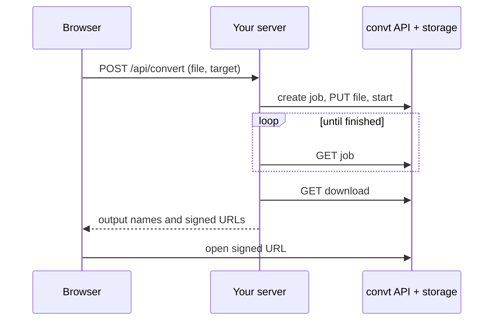

A `cvt_live_` key can spend up to your cap, so it must never reach the browser. Put a small route on your server between the browser and convt.



## Why the upload goes through your server

convt's storage accepts browser uploads only from convt.app. A `PUT` from your site's JavaScript to `upload_url` fails its CORS check, so your server uploads the file.

Downloads are different. A signed output URL works as a normal link, redirect or `` from any page, because those requests do not need CORS. Reading the output with `fetch()` from your own origin does not work.

## The browser side

```js
const body = new FormData();
body.append("file", fileInput.files[0]);
body.append("to", "webp");

const res = await fetch("/api/convert", { method: "POST", body });
const { outputs } = await res.json();
window.location.href = outputs[0].url; // starts the download
```

## The server side

The route reads the file, runs the job with your key, and returns the outputs. [Server upload route](/examples/server-upload-route) is a complete version you can copy. Its core:

```js
const file = new Uint8Array(await upload.arrayBuffer());
const { job, upload_url } = await call("/v1/jobs", {
  method: "POST",
  headers: { "Content-Type": "application/json" },
  body: JSON.stringify({ input_format, target_format, input_bytes: file.byteLength }),
});
await fetch(upload_url, { method: "PUT", body: file });
// start, poll, download, then return { outputs }
```

## Things to add before production

- **Authenticate your users.** Otherwise anyone can convert files on your bill.
- **Limit file size and type** on your route, before you create a job.
- **Cap concurrency per user.** Your key has one shared limit of 120 requests a minute.
- **Return early for long jobs.** For video, return the job id right after start and let the browser poll a second route of yours, instead of holding the request open for minutes.
