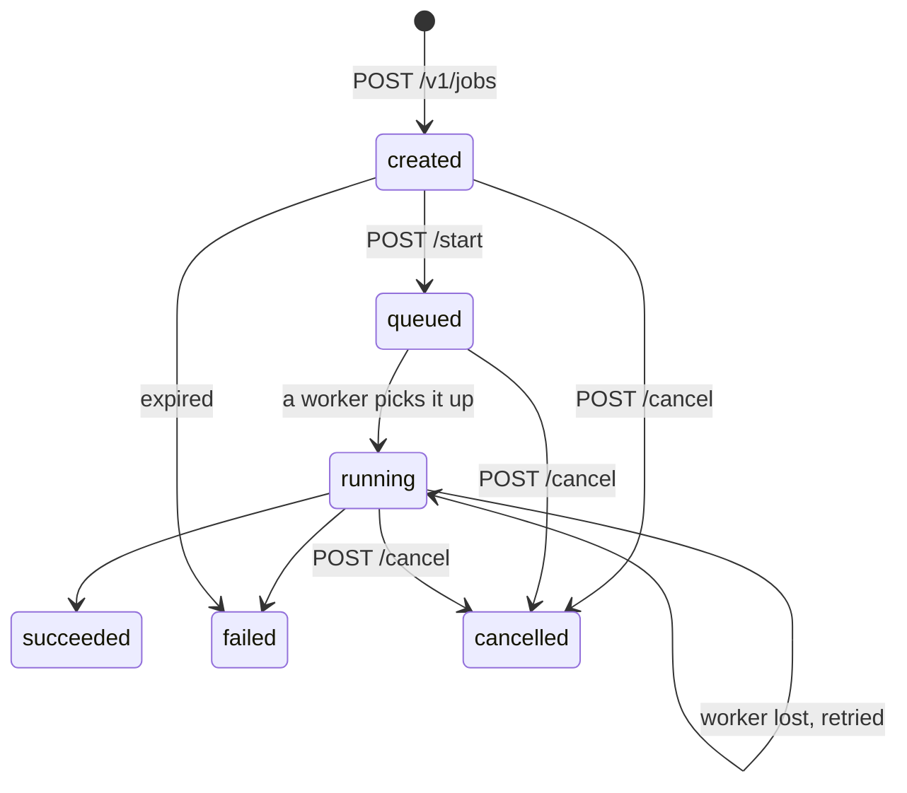

A job moves through a fixed set of statuses. Read `status` from any job response to see where it is.

| Status      | Meaning                                                          | Next step                |
| ----------- | ---------------------------------------------------------------- | ------------------------ |
| `created`   | Reserved. Waiting for your upload and `start`.                   | Upload, then call start. |
| `queued`    | Upload checked. Waiting for a worker.                            | Poll.                    |
| `running`   | A worker is converting the file.                                 | Poll.                    |
| `succeeded` | Outputs are ready. You were billed 1 cent.                       | Call download.           |
| `failed`    | The conversion did not finish. `error_code` says why. No charge. | Read `error_code`.       |
| `cancelled` | You cancelled it. No charge.                                     | Nothing.                 |

`uploaded` appears in the schema but is not used yet. Treat it like `created`.

## Timing

- **Upload window.** The `upload_url` from `POST /v1/jobs` works for 15 minutes.
- **Conversion time.** Each attempt can run for up to 10 minutes. Most image and document conversions finish in a few seconds.
- **Retries.** If a worker stops responding for 30 seconds, another worker picks the job up again. The status stays `running` and `attempt` goes up by one. After 3 attempts the job fails with `expired_or_exhausted`.
- **Expiry.** A job, its upload and its outputs are deleted 24 hours after creation. Reads then return `404`. A job that has not succeeded by then fails with `expired`.

## Failure codes

When `status` is `failed`, `error_code` is one of:

| `error_code`           | Meaning                                                                                                        |
| ---------------------- | -------------------------------------------------------------------------------------------------------------- |
| `conversion_failed`    | The converter could not convert this file, or hit the 10-minute limit. The file may be damaged or unsupported. |
| `expired`              | The job reached its 24-hour expiry before it finished. Usually the file was never uploaded or started.         |
| `expired_or_exhausted` | Every retry was used up, or the job expired while running.                                                     |
| `worker_shutdown`      | The worker shut down during the conversion. Create a new job.                                                  |

A failed job releases its reservation, so you are not charged. Create a new job to try again.

## Billing

Creating a job reserves 1 cent against your spend cap. The reservation turns into a charge when the job succeeds and is released when it fails or is cancelled. Calling `start` or `download` more than once never charges twice.
