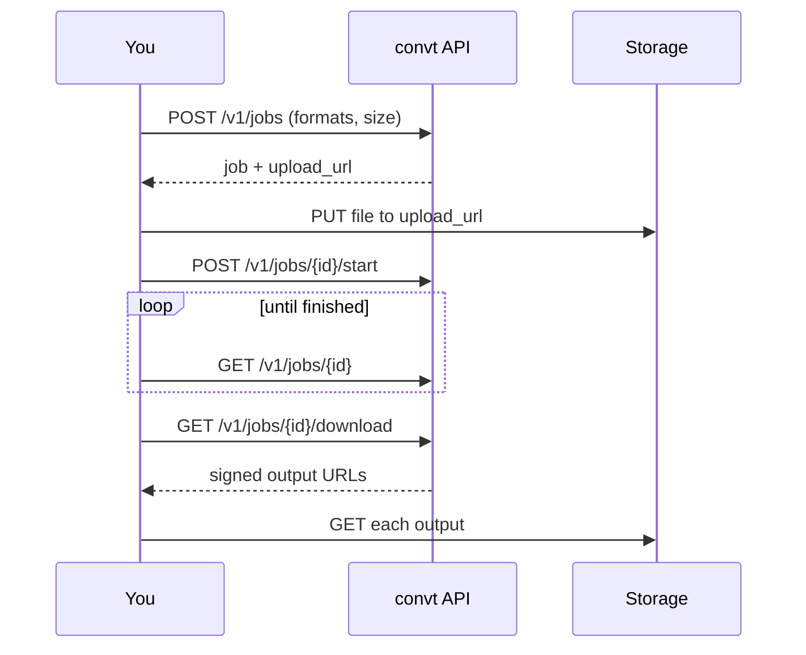

The convt API converts files on convt's servers. You send a file, pick a target format, and get the converted file back. It handles the same formats as the convt desktop app: images, video, audio, documents and PDFs.

Use the API when the conversion has to happen in your own product or pipeline. If you only need to convert files on your own machine, the [desktop app and CLI](https://convt.app/download) do it locally, with no API key and no upload.

## How a conversion works

Every conversion is a **job**. The API never receives your file in a request body. Your code uploads it straight to storage through a signed URL, which keeps large files off the API and lets uploads go up to 2 GB.

1. **Create** a job with the input format, the target format and the exact file size.
2. **Upload** the file with `PUT` to the `upload_url` in the response.
3. **Start** the job. convt checks the upload and queues it.
4. **Poll** the job until its status is `succeeded`, `failed` or `cancelled`.
5. **Download** the outputs from the signed URLs the API returns.

The [Quick start](/quick-start) runs all five steps in Node, cURL, a browser app and the CLI.

## What you need

- A convt account with API billing. Subscribe on the [API page of the dashboard](https://convt.app/dashboard/api), where you also set a spend cap for each billing period.
- A `cvt_live_` API key from the same page. See [Authentication](/guides/authentication).

## Pricing

Each job that succeeds costs 1 cent. Failed and cancelled jobs cost nothing. Creating a job reserves 1 cent against your spend cap until it finishes, so the API refuses new jobs with `limit_reached` once your used and reserved spend reaches the cap.

## Base URL

Use `api.convt.app` as the production base URL. See [Base URL](/reference/base-url).

## Next steps

<CardGroup cols={2}>
  <Card title="Quick start" href="/quick-start" icon="rocket">
    Convert your first file in Node, cURL, the browser or the CLI.
  </Card>
  <Card title="Job lifecycle" href="/guides/job-lifecycle" icon="refresh-cw">
    Statuses, timing and what each step checks.
  </Card>
  <Card title="API reference" href="/api" icon="braces">
    Every route, parameter and response.
  </Card>
  <Card title="Errors" href="/reference/errors" icon="triangle-alert">
    Every error code and what to do about it.
  </Card>
</CardGroup>
